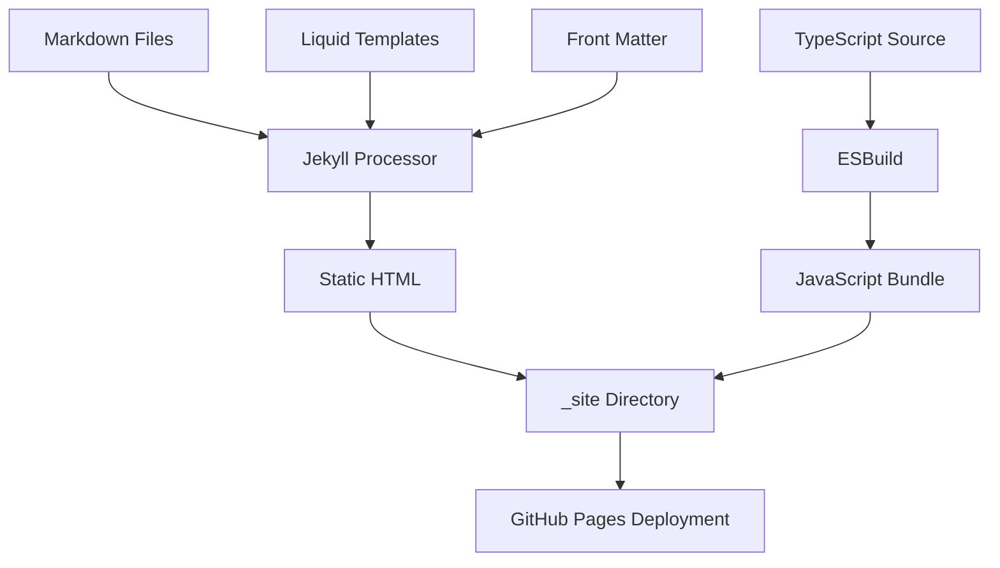
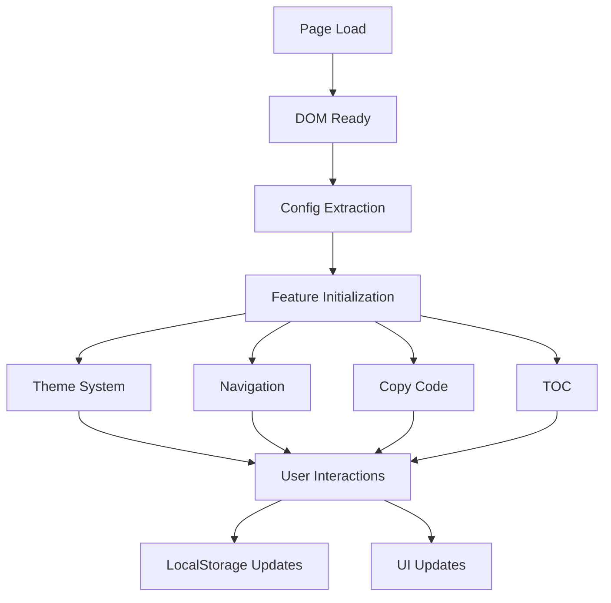

# 🏗️ Jekyll Integration Architecture

## Overview

This document describes how the TypeScript frontend integrates with Jekyll's static site generation, including data flow, asset management, and deployment patterns.

## Architecture Overview

```
┌─────────────────┐    ┌──────────────────┐    ┌─────────────────┐
│   Jekyll Build  │───▶│   Static Files   │───▶│   Browser       │
│                 │    │                  │    │                 │
│ • Markdown →    │    │ • HTML Pages     │    │ • JavaScript    │
│   HTML          │    │ • CSS Files      │    │ • CSS Styles    │
│ • Liquid        │    │ • JavaScript     │    │ • Dynamic UI    │
│   Templates     │    │   Bundle         │    │ • Theme Switch  │
│ • Front Matter  │    │ • Assets         │    │ • Navigation    │
│                 │    │                  │    │ • Copy Code     │
└─────────────────┘    └──────────────────┘    └─────────────────┘
        │                       │                       │
        ▼                       ▼                       ▼
┌─────────────────┐    ┌──────────────────┐    ┌─────────────────┐
│   Site Data     │    │   Runtime        │    │   User          │
│                 │    │   Configuration  │    │   Interaction   │
│ • _config.yml   │    │ • Theme Mode     │    │ • Theme Toggle  │
│ • Front Matter  │    │ • Feature Flags  │    │ • Copy Code     │
│ • Collections   │    │ • Page Context   │    │ • Navigation    │
│ • Posts/Pages   │    │ • Environment    │    │ • TOC Scroll    │
└─────────────────┘    └──────────────────┘    └─────────────────┘
```

## Data Flow Architecture

### 1. Build-Time Data Flow



### 2. Runtime Data Flow



## Configuration System

### Jekyll Front Matter Integration

```yaml
---
layout: post
title: "Understanding Jekyll TypeScript Integration"
date: 2025-01-10
categories: [development, jekyll]
tags: [typescript, frontend, architecture]
theme: dark
features:
  - toc
  - copy-code
  - social-share
---
```

### Site Configuration (_config.yml)

```yaml
# Jekyll Configuration
baseurl: ""
url: "https://quocnv15.github.io"

# Build settings
markdown: kramdown
highlighter: rouge
plugins:
  - jekyll-feed
  - jekyll-sitemap

# TypeScript Frontend Configuration
typescript:
  theme: system
  features:
    search: true
    toc: true
    copy_code: true
    social_share: true
    analytics: true

# Performance
compress_html:
  clippings: all
  comments: all
  endings: all
  startings: []
  blanklines: false
  profile: false
```

### Runtime Configuration Injection

```html
<!-- In _layouts/default.html -->
<script type="application/json" id="site-config">
  {
    "theme": "system",
    "searchEnabled": false,
    "tocEnabled": false,
    "copyCodeEnabled": true,
    "shareButtonsEnabled": false,
    "isPost": false,
    "isHomePage": true,
    "environment": "{{ jekyll.environment }}"
  }
</script>
```

```html
<!-- In _layouts/post.html -->
<script type="application/json" id="site-config">
  {
    "theme": "system",
    "searchEnabled": false,
    "tocEnabled": true,
    "copyCodeEnabled": true,
    "shareButtonsEnabled": true,
    "isPost": true,
    "isHomePage": false,
    "environment": "{{ jekyll.environment }}"
  }
</script>
```

## Asset Management

### JavaScript Bundle Loading

```html
<!-- In _layouts/default.html -->
<!-- TypeScript Bundle -->
<script type="module" defer
  src="{{ '/assets/js/main.js' | relative_url }}?v={{ site.time | date: '%s' }}">
</script>

<!-- Site Configuration for TypeScript -->
<script type="application/json" id="site-config">
  {
    "theme": "system",
    "searchEnabled": false,
    "tocEnabled": false,
    "copyCodeEnabled": true,
    "shareButtonsEnabled": false,
    "isPost": false,
    "isHomePage": true,
    "environment": "{{ jekyll.environment }}"
  }
</script>
```

**Bundle Loading Features:**
- **ES6 Modules**: Modern JavaScript with type safety
- **Deferred Loading**: Non-blocking script execution
- **Cache Busting**: Timestamp-based versioning (`?v={{ site.time | date: '%s' }}`)
- **Relative URLs**: Jekyll processes asset paths correctly
- **Configuration Bridge**: JSON config passes Jekyll context to TypeScript

### CSS Management Strategy

```scss
// Main SCSS structure
@import 'variables';
@import 'mixins';
@import 'base';
@import 'layout';
@import 'components';
@import 'utilities';

// Theme-specific styles injected by TypeScript
[data-theme="dark"] {
  @import 'theme-dark';
}

// Component styles for TypeScript features
.theme-toggle { /* Styles */ }
.copy-button { /* Styles */ }
.toc-container { /* Styles */ }
```

## Page Types and Contexts

### Blog Post Context

```typescript
interface PostContext {
  isPost: boolean;
  title: string;
  date: string;
  categories: string[];
  tags: string[];
  hasCodeBlocks: boolean;
  wordCount: number;
  readingTime: number;
  // Feature detection
  features: {
    tocEnabled: boolean;
    copyCodeEnabled: boolean;
    socialShareEnabled: boolean;
  };
}
```

### Home Page Context

```typescript
interface HomePageContext {
  isHomePage: boolean;
  posts: PostSummary[];
  categories: Category[];
  recentPosts: PostSummary[];
  featuredPosts: PostSummary[];
}
```

### General Page Context

```typescript
interface PageContext {
  title: string;
  description: string;
  url: string;
  language: string;
  environment: 'development' | 'production';
  theme: ThemeMode;
  lastModified: string;
}
```

## Feature Integration Patterns

### 1. Theme System Integration

```typescript
// Jekyll provides theme preference
const config = getSiteConfig();
const defaultTheme = config.theme || 'system';

// TypeScript handles theme switching
const themeManager = new ThemeManager(defaultTheme);
themeManager.init();
```

### 2. Content Feature Detection

```typescript
// Detect features based on page content
const features = {
  tocEnabled: document.body.classList.contains('post'),
  copyCodeEnabled: !!document.querySelector('pre code'),
  socialShareEnabled: !!document.querySelector('.share-links'),
  searchEnabled: !!document.querySelector('#search-input')
};
```

### 3. Navigation Enhancement

```typescript
// Enhance Jekyll's default navigation
const nav = document.querySelector('.site-navigation');
if (nav) {
  new NavigationEnhancer(nav).init();
}
```

## Development Workflow

### Local Development Setup

```bash
# Terminal 1: Jekyll development server
bundle exec jekyll serve --livereload --port 4001

# Terminal 2: TypeScript development
npm run dev:ts

# Terminal 3: Type checking
npm run check:types:watch
```

### File Watching Strategy

```javascript
// build.js watch mode
chokidar.watch('src/ts/**/*.ts')
  .on('change', (filePath) => {
    console.log(`📝 Changed: ${filePath}`);
    rebuildTypeScript();
    livereload.reload();
  });
```

### Error Handling Integration

```typescript
// Jekyll build errors vs runtime errors
window.addEventListener('error', (event) => {
  if (event.filename.includes('.js')) {
    console.error('TypeScript runtime error:', event.error);
    // Send to error tracking (in production)
  }
});
```

## Performance Optimization

### Build-Time Optimizations

```yaml
# _config.yml performance settings
compress_html:
  clippings: all
  comments: all
  endings: all

# Exclude unnecessary files from build
exclude:
  - node_modules/
  - src/
  - tsconfig.json
  - package*.json
  - README.md
```

### Runtime Optimizations

```typescript
// Lazy loading for non-critical features
const initOptionalFeatures = async () => {
  if (features.searchEnabled) {
    const { initSearch } = await import('./modules/search');
    await initSearch();
  }
};

// Intersection Observer for performance
const observer = new IntersectionObserver((entries) => {
  entries.forEach(entry => {
    if (entry.isIntersecting) {
      // Initialize feature when visible
    }
  });
});
```

## Deployment Architecture

### GitHub Pages Integration

```yaml
# .github/workflows/deploy.yml
name: Deploy to GitHub Pages
on:
  push:
    branches: [main]

jobs:
  build-and-deploy:
    runs-on: ubuntu-latest
    steps:
      - uses: actions/checkout@v3
      - uses: actions/setup-node@v3
      - run: npm ci
      - run: npm run build:prod
      - uses: peaceiris/actions-gh-pages@v3
        with:
          github_token: ${{ secrets.GITHUB_TOKEN }}
          publish_dir: ./_site
```

### Environment-Specific Configurations

```typescript
// Environment detection and configuration
const environment = jekyllEnvironment || 'development';
const config = {
  isProduction: environment === 'production',
  enableAnalytics: environment === 'production',
  enableDebugMode: environment === 'development',
  apiEndpoint: environment === 'production'
    ? 'https://api.example.com'
    : 'http://localhost:3000'
};
```

## Testing Integration

### Jekyll Test Scenarios

```typescript
// Mock Jekyll environment for testing
const mockJekyllConfig = {
  environment: 'test',
  baseurl: '',
  url: 'http://localhost:4000',
  typescript: {
    theme: 'light',
    features: {
      search: true,
      toc: true,
      copy_code: true
    }
  }
};
```

### End-to-End Testing Strategy

```typescript
// Test integration with Jekyll-generated content
describe('Jekyll Integration', () => {
  beforeEach(() => {
    // Load test HTML that mimics Jekyll output
    document.body.innerHTML = loadJekyllTestTemplate();
  });

  test('initializes theme system from Jekyll config', () => {
    const configScript = document.getElementById('site-config');
    expect(configScript).not.toBeNull();

    const config = JSON.parse(configScript!.textContent);
    expect(config.theme).toBe('system');
  });
});
```

## Security Considerations

### Content Security Policy

```html
<!-- CSP header for GitHub Pages -->
<meta http-equiv="Content-Security-Policy"
      content="default-src 'self';
               script-src 'self' 'unsafe-inline';
               style-src 'self' 'unsafe-inline';
               img-src 'self' data: https:;
               font-src 'self' data:;">
```

### XSS Prevention

```typescript
// Sanitize Jekyll-provided data
const sanitizeJekyllData = (data: any): any => {
  if (typeof data === 'string') {
    return data.replace(/<script\b[^<]*(?:(?!<\/script>)<[^<]*)*<\/script>/gi, '');
  }
  return data;
};
```

---

**Last Updated**: 2025-10-14
**Review Frequency**: Monthly
**Owner**: Tech Lead (Member 1) & Frontend Dev (Member 2)