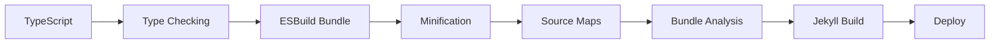
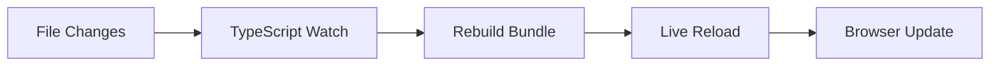

# 🏗️ Project Structure Documentation

## Overview

This document describes the complete project structure, organization patterns, and architectural decisions for the Jekyll TypeScript frontend.

## 📁 Directory Structure

```
quocnv15.github.io/
├── 📁 agent/                           # 📚 Agent documentation system
│   ├── 📄 README.md                    # Main documentation index
│   ├── 📁 System/                      # System architecture docs
│   │   ├── 📄 tech-stack.md           # Technology stack overview
│   │   ├── 📄 jekyll-architecture.md  # Jekyll integration patterns
│   │   └── 📄 project-structure.md    # This file
│   ├── 📁 SOP/                         # Standard Operating Procedures
│   │   ├── 📄 feature-development.md  # Feature development workflow
│   │   ├── 📄 testing-procedures.md   # Testing standards and procedures
│   │   └── 📄 migration-guidelines.md # System migration procedures
│   └── 📁 Tasks/                       # Project management and backlog
│       └── 📄 implementation-backlog.md # Prioritized task list
│
├── 📁 _includes/                       # Jekyll include templates
├── 📁 _layouts/                        # Jekyll layout templates
├── 📁 _posts/                          # Blog posts (Markdown)
├── 📁 _projects/                       # Project showcase content
├── 📁 _site/                           # Generated Jekyll site
├── 📁 assets/                          # Static assets
│   └── 📁 js/                          # Compiled JavaScript bundles
│       ├── 📄 main.js                  # Main application bundle
│       └── 📄 main.js.map             # Source maps
│
├── 📁 css/                             # Stylesheets
│   ├── 📄 main.scss                   # Main SCSS file
│   └── 📄 syntax.scss                 # Code highlighting styles
│
├── 📁 src/                             # Source code
│   ├── 📁 test/                        # Test files
│   │   ├── 📄 setup.ts                # Test configuration
│   │   ├── 📁 unit/                   # Unit tests
│   │   └── 📁 integration/            # Integration tests
│   └── 📁 ts/                          # TypeScript source
│       ├── 📁 components/              # UI components
│       │   └── 📄 theme-toggle.component.ts
│       ├── 📁 constants/              # Application constants
│       │   └── 📄 index.ts
│       ├── 📁 hooks/                  # Custom hooks (DOM-focused)
│       │   └── 📄 useDeviceDetection.ts
│       ├── 📁 interfaces/             # TypeScript interfaces
│       │   └── 📄 types.ts
│       ├── 📁 modules/                # Feature modules
│       │   ├── 📁 utils/              # Utility functions
│       │   │   └── 📄 dom.ts
│       │   ├── 📄 theme.ts            # Theme management
│       │   ├── 📄 navigation.ts       # Navigation enhancements
│       │   ├── 📄 copy-code.ts        # Code copying
│       │   └── 📄 toc.ts              # Table of contents
│       ├── 📁 services/               # Business services
│       │   └── 📄 config.service.ts   # Configuration management
│       ├── 📁 types/                  # Type definitions
│       │   ├── 📄 index.ts            # Main type exports
│       │   └── 📄 post.ts             # Post-specific types
│       └── 📄 main.ts                 # Application entry point
│
├── 📄 _config.yml                      # Jekyll configuration
├── 📄 Gemfile                          # Ruby dependencies
├── 📄 package.json                     # Node.js dependencies
├── 📄 package-lock.json               # NPM lock file
├── 📄 tsconfig.json                    # TypeScript configuration
├── 📄 vitest.config.ts                # Test configuration
├── 📄 build.js                         # Build script
├── 📄 IMPROVEMENT_ROADMAP_CHECKLIST.md # Project roadmap
└── 📄 README.md                        # Project README
```

## 🏗️ Architectural Layers

### 1. Presentation Layer
```
Jekyll Templates (Liquid) + HTML
        ↓
CSS/SCSS Styles
        ↓
TypeScript Components
```

### 2. Business Logic Layer
```
Feature Modules
├── Theme System
├── Navigation
├── Copy Code
├── Table of Contents
└── (Future modules)
```

### 3. Service Layer
```
Services
├── Configuration Service
├── (Future: Analytics Service)
├── (Future: Storage Service)
└── (Future: API Service)
```

### 4. Infrastructure Layer
```
Core Systems
├── Type Definitions
├── DOM Utilities
├── Memory Management
└── Build System
```

## 📦 Module Organization

### Components (`src/ts/components/`)
**Purpose**: Reusable UI components with lifecycle management
**Pattern**: Component-based architecture with cleanup hooks
**Examples**: Theme toggle, modal dialogs, form elements

```typescript
// Component structure example
export class ThemeToggleComponent extends BaseComponent {
  constructor(element: HTMLElement) {
    super(element);
    this.init();
  }

  protected init(): void {
    // Component initialization
  }

  protected cleanup(): void {
    // Component cleanup
  }
}
```

### Modules (`src/ts/modules/`)
**Purpose**: Feature-specific functionality and business logic
**Pattern**: Functional modules with clear interfaces
**Examples**: Theme management, navigation enhancement, code copying

```typescript
// Module structure example
export interface ThemeModule {
  init: (config?: ThemeConfig) => Promise<void>;
  destroy: () => void;
  setTheme: (theme: ThemeMode) => void;
  getTheme: () => ThemeMode;
}

export const createThemeModule = (): ThemeModule => {
  // Module implementation
};
```

### Services (`src/ts/services/`)
**Purpose**: Business services and data management
**Pattern**: Service-oriented architecture with dependency injection
**Examples**: Configuration, caching, API communication

```typescript
// Service structure example
export interface ConfigService {
  get: <T>(key: string) => T | undefined;
  set: <T>(key: string, value: T) => void;
  reset: () => void;
}
```

### Utilities (`src/ts/modules/utils/`)
**Purpose**: Helper functions and common operations
**Pattern**: Pure functions with no side effects
**Examples**: DOM manipulation, event handling, validation

```typescript
// Utility structure example
export const qsSafe = <T extends Element = Element>(
  selector: string
): T | null => {
  try {
    return document.querySelector<T>(selector);
  } catch {
    return null;
  }
};
```

## 🔄 Data Flow Architecture

### Configuration Flow
```
Jekyll _config.yml → Front Matter → Runtime Config → Services → Modules
```

### Event Flow
```
User Interaction → Component → Module → Service → State Update → UI Update
```

### Build Flow
```
TypeScript → ESBuild → Bundle → Minify → Assets → Jekyll Build → Deploy
```

## 🎯 Design Patterns

### 1. Module Pattern
- **Encapsulation**: Private state with public interfaces
- **Lazy Loading**: Modules load only when needed
- **Cleanup**: Proper resource management

### 2. Observer Pattern
- **Event System**: Decoupled communication
- **Theme Changes**: Global state updates
- **Configuration Updates**: Reactive configuration

### 3. Factory Pattern
- **Service Creation**: Dependency injection
- **Module Instantiation**: Configuration-based creation
- **Test Mocking**: Easy testing setup

### 4. Strategy Pattern
- **Theme Systems**: Multiple theme strategies
- **Storage Methods**: LocalStorage, sessionStorage, memory
- **Feature Detection**: Browser capability handling

## 🧪 Testing Architecture

### Test Structure
```
src/test/
├── setup.ts              # Global test configuration
├── mocks/               # Mock implementations
├── unit/                # Unit tests per module
└── integration/         # Cross-module tests
```

### Testing Patterns
- **Unit Tests**: Isolated module testing
- **Integration Tests**: Module interaction testing
- **DOM Testing**: JSDOM-based browser simulation
- **Mock Testing**: Service and API mocking

## 🔧 Build Architecture

### Build Pipeline


### Development Workflow


## 📊 File Naming Conventions

### TypeScript Files
- **Components**: `name.component.ts`
- **Modules**: `feature-name.ts`
- **Services**: `feature.service.ts`
- **Types**: `feature.types.ts`
- **Utilities**: `utility-name.ts`
- **Tests**: `feature.test.ts`

### CSS Files
- **Main Styles**: `main.scss`
- **Components**: `_component.scss`
- **Utilities**: `_utilities.scss`
- **Themes**: `_theme.scss`

### Documentation Files
- **KEBAB-CASE.md**: All documentation files
- **Lowercase directories**: Consistent folder naming
- **Index files**: `README.md` or `index.ts` for entry points

## 🔒 Security Considerations

### File Access Patterns
- **Public Assets**: `/assets/` directory
- **Source Code**: `/src/` directory (build only)
- **Configuration**: Jekyll config, not exposed
- **Secrets**: Environment variables only

### Content Security
- **XSS Prevention**: DOM sanitization
- **Secure Defaults**: Safe configuration options
- **Input Validation**: Type-safe data handling
- **Dependency Security**: Regular vulnerability scanning

## 🚀 Performance Architecture

### Bundle Optimization
- **Tree Shaking**: Unused code elimination
- **Code Splitting**: Feature-based bundles (planned)
- **Minification**: Production bundle optimization
- **Compression**: Gzip compression

### Loading Strategy
- **Critical CSS**: Inline critical styles
- **Lazy Loading**: Non-critical features
- **Progressive Enhancement**: Core functionality first
- **Cache Strategy**: Long-term asset caching

## 🔮 Future Architecture Plans

### Planned Improvements
1. **Plugin System**: Dynamic feature loading
2. **State Management**: Centralized state store
3. **Code Splitting**: Feature-based bundles
4. **Service Workers**: Offline functionality
5. **Micro-Frontends**: Modular deployment

### Scalability Considerations
- **Module Boundaries**: Clear separation of concerns
- **API Design**: Stable interfaces for extensions
- **Testing Infrastructure**: Comprehensive test coverage
- **Documentation**: Self-documenting code architecture

---

**Last Updated**: 2025-01-10
**Review Frequency**: Monthly or after major changes
**Owner**: Tech Lead (Member 1)