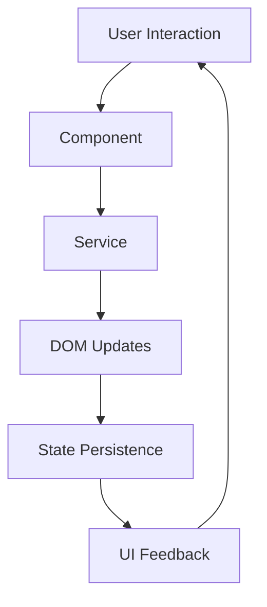

# Project Architecture

This document describes the architecture and organization of the Jekyll TypeScript frontend.

## 📁 Directory Structure

```
src/ts/                       # TypeScript source code
├── main.ts                   # Application entry point
├── types/                    # Type definitions
│   └── index.ts             # Global types and interfaces
├── constants/                # Application constants
│   └── index.ts             # Selectors, CSS classes, etc.
├── services/                 # Business logic services
│   └── config.service.ts    # Configuration management
├── components/               # Reusable UI components
│   └── theme-toggle.component.ts
├── hooks/                    # Custom React-like hooks
│   └── useDeviceDetection.ts
├── modules/                  # Feature modules
│   ├── theme.ts             # Theme management
│   ├── navigation.ts        # Mobile navigation
│   ├── copy-code.ts         # Copy code functionality
│   ├── toc.ts               # Table of contents
│   └── utils/               # Utility functions
│       └── dom.ts           # DOM manipulation utilities
└── interfaces/              # Legacy interfaces (being migrated)
    └── types.ts             # Original type definitions

assets/js/                    # Compiled JavaScript output
├── main.js                   # Main bundle
└── main.js.map               # Source map file
```

## 🏗️ Architecture Patterns

### 1. **Component-Based Architecture**
- Reusable UI components with encapsulated logic
- Consistent lifecycle management
- Clean separation of concerns

### 2. **Service Layer**
- Centralized business logic
- Singleton pattern for configuration
- Easy testing and mocking

### 3. **Hook Pattern**
- Reusable stateful logic
- Device detection utilities
- Cross-component state sharing

### 4. **Module System**
- Feature-based organization
- Clear dependencies
- Lazy loading capabilities

## 🔄 Data Flow



## 🎯 Core Principles

1. **Type Safety**: Full TypeScript strict mode
2. **Performance**: Optimized bundle size and loading
3. **Accessibility**: WCAG compliant interactions
4. **Maintainability**: Clean, documented code
5. **Testability**: Modular, dependency-injected design

## 🔧 Build Process

1. **TypeScript Compilation**: `tsc --noEmit` (type checking)
2. **Bundling**: `esbuild` (fast, optimized)
3. **Analysis**: Bundle size and dependency analysis
4. **Output**: Single optimized bundle with source maps

## 📦 Bundle Structure

The final bundle contains:
- Core application logic
- All feature modules
- Utility functions
- Type definitions (development only)

## 🚀 Performance Optimizations

- **Tree Shaking**: Unused code elimination
- **Minification**: Production builds are minified
- **Source Maps**: Available for debugging
- **Caching**: Cache-busting via query parameters
- **Lazy Loading**: Features loaded on demand

## 🧪 Testing Strategy

- **Unit Tests**: Individual function/component testing
- **Integration Tests**: Module interaction testing
- **E2E Tests**: Full user journey testing
- **Bundle Testing**: Production bundle validation