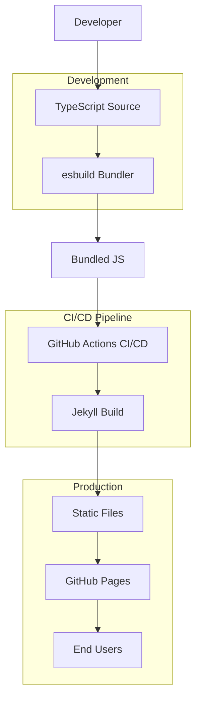

# Technical Requirements & Architecture

**Document Version:** 1.0
**Last Updated:** TBD
**Target Environment:** Production Jekyll Blog
**Technology Stack:** TypeScript + esbuild + Jekyll + GitHub Pages

---

## 🏗️ Architecture Overview

### System Architecture Diagram



### Technology Stack Rationale

| Technology | Purpose | Rationale |
|------------|---------|-----------|
| **TypeScript 5.0+** | Type-safe JavaScript | Static typing, better IDE support, catch errors early |
| **esbuild** | Bundling & minification | Extremely fast, minimal configuration, tree-shaking |
| **Jekyll** | Static Site Generator | Keep existing setup, GitHub Pages native support |
| **GitHub Actions** | CI/CD Pipeline | Automated builds, TypeScript checking, deployment |
| **GitHub Pages** | Hosting | Free, SSL, custom domains, Git-based deployment |

---

## 📁 Directory Structure

### Final Production Structure

```
quocnv15.github.io/
├── src/ts/                          # TypeScript source code
│   ├── main.ts                      # Application entry point
│   ├── modules/                     # Feature modules
│   │   ├── toc.ts                   # Table of Contents
│   │   ├── theme.ts                 # Dark mode toggle
│   │   ├── search.ts                # Live search
│   │   ├── copy-code.ts             # Copy to clipboard
│   │   ├── navigation.ts            # Mobile navigation
│   │   ├── share.ts                 # Social sharing
│   │   └── utils/                   # Utility modules
│   │       ├── dom.ts               # DOM manipulation utilities
│   │       ├── storage.ts           # LocalStorage utilities
│   │       ├── errors.ts            # Error handling
│   │       └── performance.ts       # Performance monitoring
│   ├── interfaces/                  # TypeScript type definitions
│   │   ├── post.ts                  # Post-related types
│   │   ├── search.ts                # Search-related types
│   │   ├── ui.ts                    # UI state types
│   │   └── config.ts                # Configuration types
│   └── data/                        # Static data
│       └── search-index.ts          # Search index structure
│
├── assets/js/                       # Compiled JavaScript output
│   ├── main.min.js                  # Production bundle
│   └── main.min.js.map              # Source map for debugging
│
├── _layouts/                        # Jekyll layouts (modified)
│   ├── default.html                 # Updated with TypeScript bundle
│   ├── post.html                    # Enhanced with TOC support
│   └── page.html                    # Updated layouts
│
├── _includes/                       # Jekyll includes (existing)
├── _posts/                          # Blog posts (existing)
├── _notes/                          # Knowledge curation (existing)
├── css/                             # Stylesheets (existing)
├── js/                              # Legacy JavaScript (to be removed)
│   └── highlightjs/                 # Keep syntax highlighting
│
├── docs/typescript-migration/       # Migration documentation
│   ├── README.md                    # Migration overview
│   ├── timeline.md                  # Project timeline
│   ├── technical-requirements.md    # This document
│   └── checklist.md                 # Migration checklist
│
├── .github/workflows/               # GitHub Actions (updated)
│   └── pages.yml                    # Enhanced deployment pipeline
│
├── package.json                     # npm configuration
├── tsconfig.json                    # TypeScript configuration
├── build.js                         # esbuild configuration
├── Gemfile                          # Ruby dependencies (existing)
└── _config.yml                      # Jekyll configuration (existing)
```

---

## ⚙️ Configuration Files

### TypeScript Configuration (tsconfig.json)

```json
{
  "compilerOptions": {
    // Strict Type Checking
    "strict": true,
    "noUncheckedIndexedAccess": true,
    "noImplicitReturns": true,
    "noFallthroughCasesInSwitch": true,
    "exactOptionalPropertyTypes": true,
    "noImplicitOverride": true,

    // Module Configuration
    "module": "esnext",
    "target": "es2019",
    "lib": ["ES2020", "DOM"],
    "moduleResolution": "bundler",
    "verbatimModuleSyntax": true,

    // Output Configuration
    "declaration": true,
    "outDir": "./dist",
    "rootDir": "./src",
    "sourceMap": true,
    "removeComments": false,

    // Code Quality
    "allowUnusedLabels": false,
    "allowUnreachableCode": false,
    "forceConsistentCasingInFileNames": true,

    // Interop Constraints
    "skipLibCheck": true,
    "isolatedModules": true
  },
  "include": [
    "src/**/*"
  ],
  "exclude": [
    "node_modules",
    "dist",
    "assets",
    "_site",
    ".jekyll-cache"
  ]
}
```

### esbuild Configuration (build.js)

```javascript
const esbuild = require('esbuild');
const path = require('path');

const isProduction = process.env.NODE_ENV === 'production';
const isWatch = process.argv.includes('--watch');

const buildConfig = {
  entryPoints: ['src/ts/main.ts'],
  bundle: true,
  minify: isProduction,
  sourcemap: true,
  target: 'es2019',
  format: 'esm',
  outdir: 'assets/js',
  define: {
    'process.env.NODE_ENV': `"${process.env.NODE_ENV || 'development'}"`
  },
  loader: {
    '.ts': 'ts'
  },
  plugins: [
    // TypeScript checking plugin
    {
      name: 'typescript-checker',
      setup(build) {
        build.onStart(() => {
          console.log('🔍 Checking TypeScript types...');
          const { execSync } = require('child_process');

          try {
            execSync('npx tsc --noEmit', { stdio: 'pipe' });
            console.log('✅ TypeScript types check passed');
          } catch (error) {
            console.error('❌ TypeScript errors found:');
            console.error(error.stdout.toString());

            if (!isWatch) {
              console.error('🚫 Build failed due to TypeScript errors');
              process.exit(1);
            } else {
              console.warn('⚠️ Continuing in watch mode despite errors');
            }
          }
        });
      }
    },

    // Bundle size analyzer plugin
    {
      name: 'bundle-analyzer',
      setup(build) {
        build.onEnd((result) => {
          if (result.metafile) {
            console.log('\n📊 Bundle Analysis:');
            Object.entries(result.metafile.outputs).forEach(([file, output]) => {
              const sizeKB = (output.bytes / 1024).toFixed(2);
              console.log(`  ${file}: ${sizeKB} KB`);

              if (file.includes('main.min.js') && output.bytes > 153600) {
                console.warn(`⚠️ Bundle size exceeds 150KB: ${sizeKB} KB`);
              }
            });
          }
        });
      }
    }
  ],
  logLevel: 'info'
};

if (isWatch) {
  esbuild.context(buildConfig).then((context) => {
    console.log('👀 Watching for TypeScript changes...');
    context.watch();
  });
} else {
  esbuild.build(buildConfig).catch(() => {
    console.error('❌ Build failed');
    process.exit(1);
  });
}
```

### Package.json Scripts

```json
{
  "name": "quocnv15-jekyll-blog",
  "version": "1.0.0",
  "description": "Jekyll blog with TypeScript frontend",
  "main": "src/ts/main.ts",
  "scripts": {
    "build:ts": "node build.js",
    "build:ts:watch": "node build.js --watch",
    "check:types": "tsc --noEmit",
    "check:types:watch": "tsc --noEmit --watch",
    "dev": "npm run build:ts:watch",
    "build": "npm run build:ts && npm run check:types",
    "clean": "rm -rf assets/js/*.js assets/js/*.js.map dist",
    "size-check": "npm run build && du -h assets/js/main.min.js",
    "serve": "bundle exec jekyll serve --livereload",
    "build:jekyll": "bundle exec jekyll build",
    "deploy": "npm run build && npm run build:jekyll",
    "test:bundle": "npm run build && node -e \"require('./assets/js/main.min.js')\"",
    "lint": "eslint src/ts --ext .ts || echo 'ESLint not configured'",
    "format": "prettier --write src/ts/**/*.{ts,js} || echo 'Prettier not configured'"
  },
  "devDependencies": {
    "typescript": "^5.0.0",
    "esbuild": "^0.19.0"
  },
  "engines": {
    "node": ">=18.0.0",
    "npm": ">=8.0.0"
  },
  "keywords": [
    "jekyll",
    "typescript",
    "blog",
    "static-site"
  ],
  "author": "NGUYEN VAN QUOC",
  "license": "MIT"
}
```

---

## 🔧 TypeScript Module Architecture

### Core Module Structure

#### 1. Main Entry Point (src/ts/main.ts)

```typescript
/**
 * Jekyll Blog TypeScript Frontend
 *
 * Architecture:
 * - Modular design with feature-based organization
 * - Type-safe DOM manipulation with null safety
 * - Performance optimized with lazy loading
 * - Error handling with graceful degradation
 */

import './styles.css'; // Global styles

// Feature modules
import { initTheme, type ThemeMode } from './modules/theme';
import { initNavigation } from './modules/navigation';
import { initCopyCode } from './modules/copy-code';
import { initTOC } from './modules/toc';
import { initSearch } from './modules/search';
import { initShareButtons } from './modules/share';

// Utilities
import { ready } from './modules/utils/dom';
import { initErrorHandling, initPerformanceMonitoring } from './modules/utils/errors';

/**
 * Application configuration interface
 */
interface AppConfig {
  theme: ThemeMode;
  searchEnabled: boolean;
  tocEnabled: boolean;
  copyCodeEnabled: boolean;
  shareButtonsEnabled: boolean;
  isPost: boolean;
  isHomePage: boolean;
  environment: 'development' | 'production';
}

/**
 * Get configuration from page data or environment
 */
const getAppConfig = (): AppConfig => {
  const script = document.querySelector<HTMLScriptElement>('#site-config');

  if (script?.textContent) {
    try {
      return JSON.parse(script.textContent);
    } catch (error) {
      console.warn('Failed to parse site config:', error);
    }
  }

  // Fallback configuration based on DOM inspection
  return {
    theme: 'system',
    searchEnabled: !!document.querySelector('#search-input'),
    tocEnabled: document.body.classList.contains('post'),
    copyCodeEnabled: !!document.querySelector('pre code'),
    shareButtonsEnabled: !!document.querySelector('.share-links'),
    isPost: document.body.classList.contains('post'),
    isHomePage: document.body.classList.contains('home'),
    environment: (process.env.NODE_ENV as AppConfig['environment']) || 'development'
  };
};

/**
 * Initialize application with error handling
 */
const initializeApp = async (): Promise<void> => {
  const config = getAppConfig();

  try {
    // Initialize core infrastructure
    initErrorHandling();
    initPerformanceMonitoring();

    // Initialize features based on configuration
    initTheme(config.theme);
    initNavigation();

    if (config.copyCodeEnabled) {
      await initCopyCode();
    }

    if (config.tocEnabled && config.isPost) {
      await initTOC();
    }

    if (config.searchEnabled) {
      await initSearch();
    }

    if (config.shareButtonsEnabled && config.isPost) {
      await initShareButtons();
    }

    // Mark as ready
    document.body.classList.add('js-enabled');
    document.body.classList.remove('js-loading');

    console.log('✅ Jekyll TypeScript frontend initialized successfully');

  } catch (error) {
    console.error('❌ Failed to initialize app:', error);

    // Fallback behavior
    document.body.classList.add('js-fallback');
    document.body.classList.remove('js-loading');

    // Still enable basic functionality
    try {
      initTheme(config.theme);
      initNavigation();
    } catch (fallbackError) {
      console.error('❌ Even fallback initialization failed:', fallbackError);
    }
  }
};

/**
 * Application bootstrap
 */
ready(() => {
  document.body.classList.add('js-loading');
  initializeApp();
});

// Export for external use and testing
export { initializeApp, getAppConfig };
```

#### 2. DOM Utilities (src/ts/modules/utils/dom.ts)

```typescript
/**
 * Type-safe DOM manipulation utilities
 *
 * Provides:
 * - Safe element querying with TypeScript generics
 * - Null-checked element access
 * - Performance-optimized DOM operations
 * - Cross-browser compatibility helpers
 */

/**
 * Query selector with guaranteed return type
 * Throws error if element not found - use when element is required
 */
export const qs = <T extends Element = Element>(
  selector: string,
  parent: ParentNode = document
): T => {
  const element = parent.querySelector<T>(selector);
  if (!element) {
    throw new Error(`Required element not found: ${selector}`);
  }
  return element;
};

/**
 * Query selector with optional return type
 * Returns null if element not found - use when element is optional
 */
export const qsSafe = <T extends Element = Element>(
  selector: string,
  parent: ParentNode = document
): T | null => {
  return parent.querySelector<T>(selector);
};

/**
 * Query selector all with type safety
 */
export const qsa = <T extends Element = Element>(
  selector: string,
  parent: ParentNode = document
): NodeListOf<T> => {
  return parent.querySelectorAll<T>(selector);
};

/**
 * Create element with attributes and text content
 */
export const create = <K extends keyof HTMLElementTagNameMap>(
  tag: K,
  attributes?: Record<string, string>,
  textContent?: string
): HTMLElementTagNameMap[K] => {
  const element = document.createElement(tag);

  if (attributes) {
    Object.entries(attributes).forEach(([key, value]) => {
      element.setAttribute(key, value);
    });
  }

  if (textContent !== undefined) {
    element.textContent = textContent;
  }

  return element;
};

/**
 * Check if DOM is ready
 */
export const ready = (callback: () => void): void => {
  if (document.readyState === 'loading') {
    document.addEventListener('DOMContentLoaded', callback);
  } else {
    callback();
  }
};

/**
 * Debounce function for event handlers
 */
export const debounce = <T extends (...args: any[]) => any>(
  func: T,
  wait: number
): ((...args: Parameters<T>) => void) => {
  let timeout: NodeJS.Timeout;

  return (...args: Parameters<T>) => {
    clearTimeout(timeout);
    timeout = setTimeout(() => func(...args), wait);
  };
};

/**
 * Throttle function for scroll handlers
 */
export const throttle = <T extends (...args: any[]) => any>(
  func: T,
  limit: number
): ((...args: Parameters<T>) => void) => {
  let inThrottle: boolean;

  return (...args: Parameters<T>) => {
    if (!inThrottle) {
      func(...args);
      inThrottle = true;
      setTimeout(() => inThrottle = false, limit);
    }
  };
};

/**
 * Check if element is in viewport
 */
export const isInViewport = (element: Element): boolean => {
  const rect = element.getBoundingClientRect();
  return (
    rect.top >= 0 &&
    rect.left >= 0 &&
    rect.bottom <= (window.innerHeight || document.documentElement.clientHeight) &&
    rect.right <= (window.innerWidth || document.documentElement.clientWidth)
  );
};

/**
 * Smooth scroll to element with offset
 */
export const scrollToElement = (
  element: Element,
  offset: number = 0,
  behavior: ScrollBehavior = 'smooth'
): void => {
  const elementPosition = element.getBoundingClientRect().top + window.scrollY;
  const offsetPosition = elementPosition - offset;

  window.scrollTo({
    top: offsetPosition,
    behavior
  });
};

/**
 * Add event listener with cleanup function
 */
export const addEventListener = <K extends keyof HTMLElementEventMap>(
  element: HTMLElement,
  event: K,
  handler: (this: HTMLElement, ev: HTMLElementEventMap[K]) => any,
  options?: boolean | AddEventListenerOptions
): (() => void) => {
  element.addEventListener(event, handler, options);

  return () => {
    element.removeEventListener(event, handler, options);
  };
};

/**
 * Get computed style value
 */
export const getStyle = (element: Element, property: string): string => {
  return window.getComputedStyle(element).getPropertyValue(property);
};

/**
 * Check if CSS custom property is supported
 */
export const supportsCustomProperties = (): boolean => {
  return CSS.supports('color', 'var(--test)');
};

/**
 * Load external script dynamically
 */
export const loadScript = (src: string): Promise<void> => {
  return new Promise((resolve, reject) => {
    const script = document.createElement('script');
    script.src = src;
    script.async = true;

    script.onload = () => resolve();
    script.onerror = () => reject(new Error(`Failed to load script: ${src}`));

    document.head.appendChild(script);
  });
};
```

#### 3. Type Definitions (src/ts/interfaces/types.ts)

```typescript
/**
 * Core type definitions for Jekyll blog TypeScript frontend
 */

// Theme Management
export type ThemeMode = 'light' | 'dark' | 'system';

// UI State Management
export type UIState = 'loading' | 'ready' | 'error';
export type LoadingState = 'idle' | 'loading' | 'success' | 'error';

// Post-related Types
export interface PostMeta {
  title: string;
  url: string;
  date: string;
  tags: string[];
  excerpt?: string;
  readTime?: number;
  category?: string;
  author?: string;
}

// Table of Contents Types
export interface TocItem {
  id: string;
  text: string;
  level: number;
  children: TocItem[];
}

// Search-related Types
export interface SearchRecord {
  id: string;
  title: string;
  content: string;
  url: string;
  tags: string[];
  category: string;
  date: string;
}

export interface SearchResult {
  record: SearchRecord;
  score: number;
  matches: string[];
}

// Configuration Types
export interface SiteConfig {
  theme: ThemeMode;
  searchEnabled: boolean;
  tocEnabled: boolean;
  copyCodeEnabled: boolean;
  shareButtonsEnabled: boolean;
  isPost: boolean;
  isHomePage: boolean;
  environment: 'development' | 'production';
}

// Event Handler Types
export type EventHandler<T = Event> = (event: T) => void;
export type AsyncEventHandler<T = Event> = (event: T) => Promise<void>;

// Performance Monitoring Types
export interface PerformanceMetrics {
  bundleSize: number;
  initializationTime: number;
  firstContentfulPaint?: number;
  largestContentfulPaint?: number;
}

// Error Handling Types
export interface ErrorInfo {
  message: string;
  stack?: string;
  timestamp: number;
  url: string;
  userAgent: string;
}

// Storage Types
export interface StorageItem<T = any> {
  value: T;
  timestamp: number;
  ttl?: number; // Time to live in milliseconds
}

// Navigation Types
export interface NavigationItem {
  text: string;
  url: string;
  active?: boolean;
  children?: NavigationItem[];
}

// Share Types
export interface ShareConfig {
  title: string;
  url: string;
  description?: string;
  image?: string;
}

export type SharePlatform = 'twitter' | 'facebook' | 'linkedin' | 'email' | 'reddit';

// Utility Types
export type Optional<T, K extends keyof T> = Omit<T, K> & Partial<Pick<T, K>>;
export type RequiredBy<T, K extends keyof T> = T & Required<Pick<T, K>>;
```

---

## 🎯 Feature Specifications

### 1. Dark Mode Toggle

**Requirements:**
- Support light, dark, and system preference modes
- Persist user preference in LocalStorage
- Smooth transitions between themes
- Accessibility compliant (focus indicators, ARIA labels)
- Cross-browser compatibility

**Implementation Details:**
```typescript
// src/ts/modules/theme.ts
export const initTheme = (defaultTheme?: ThemeMode): void => {
  const theme = defaultTheme || getStoredTheme();
  applyTheme(theme);
  watchSystemTheme();
  setupThemeToggle();
};

const applyTheme = (theme: ThemeMode): void => {
  const actualTheme = theme === 'system' ? getSystemTheme() : theme;
  document.documentElement.setAttribute('data-theme', actualTheme);

  // Update toggle button state
  const toggle = qsSafe('.theme-toggle');
  if (toggle) {
    const isActive = actualTheme === 'dark';
    toggle.classList.toggle('active', isActive);
    toggle.setAttribute('aria-pressed', isActive.toString());
  }
};
```

**CSS Variables:**
```css
:root {
  --bg-primary: #ffffff;
  --bg-secondary: #f8f9fa;
  --text-primary: #2c3e50;
  --text-secondary: #5a6c7d;
  --accent: #3498db;
}

[data-theme="dark"] {
  --bg-primary: #1a1a1a;
  --bg-secondary: #2d2d2d;
  --text-primary: #ffffff;
  --text-secondary: #b0b0b0;
  --accent: #4a9eff;
}
```

### 2. Copy Code to Clipboard

**Requirements:**
- Add copy button to all code blocks
- Support modern Clipboard API with fallback
- Visual feedback for success/error states
- Accessibility compliant
- Touch-friendly on mobile devices

**Implementation Details:**
```typescript
// src/ts/modules/copy-code.ts
export const initCopyCode = (): void => {
  const codeBlocks = qsa('pre code');
  codeBlocks.forEach(setupCopyButton);
};

const copyToClipboard = async (text: string): Promise<boolean> => {
  try {
    if (navigator.clipboard && window.isSecureContext) {
      await navigator.clipboard.writeText(text);
      return true;
    }

    // Fallback for older browsers
    const textArea = document.createElement('textarea');
    textArea.value = text;
    textArea.style.position = 'fixed';
    textArea.style.left = '-999999px';
    document.body.appendChild(textArea);
    textArea.select();

    const successful = document.execCommand('copy');
    document.body.removeChild(textArea);
    return successful;
  } catch (error) {
    console.error('Copy failed:', error);
    return false;
  }
};
```

### 3. Table of Contents

**Requirements:**
- Auto-generate from h2-h6 headings
- Hierarchical structure with indentation
- Smooth scroll to sections
- Highlight current section on scroll
- Responsive design for mobile

**Implementation Details:**
```typescript
// src/ts/modules/toc.ts
export const initTOC = (): void => {
  const container = qsSafe('#toc-container');
  if (!container) return;

  const headings = qsa('article h2, article h3, article h4, article h5, article h6');
  if (headings.length === 0) return;

  const toc = generateTOC(headings);
  renderTOC(container, toc);
  setupScrollSpy(toc);
};

const generateTOC = (headings: Element[]): TocItem[] => {
  const toc: TocItem[] = [];
  const stack: TocItem[] = [];

  headings.forEach((heading, index) => {
    const id = `heading-${index}`;
    heading.id = id;

    const item: TocItem = {
      id,
      text: heading.textContent || '',
      level: parseInt(heading.tagName.charAt(1)),
      children: []
    };

    // Build hierarchy
    while (stack.length > 0 && stack[stack.length - 1].level >= item.level) {
      stack.pop();
    }

    if (stack.length === 0) {
      toc.push(item);
    } else {
      stack[stack.length - 1].children.push(item);
    }

    stack.push(item);
  });

  return toc;
};
```

### 4. Mobile Navigation

**Requirements:**
- Hamburger menu for mobile devices
- Smooth slide-in/out animations
- Click-outside-to-close functionality
- Keyboard navigation support
- Touch-friendly interaction

**Implementation Details:**
```typescript
// src/ts/modules/navigation.ts
export const initMobileNav = (): void => {
  const toggle = qsSafe('.nav-toggle');
  const menu = qsSafe('.nav-mobile');

  if (!toggle || !menu) return;

  setupToggle(toggle, menu);
  setupClickOutside(menu, toggle);
  setupKeyboardNavigation(menu);
};

const setupToggle = (toggle: HTMLElement, menu: HTMLElement): void => {
  const cleanup = addEventListener(toggle, 'click', (e) => {
    e.preventDefault();
    toggleMenu(toggle, menu);
  });

  // Store cleanup for potential removal
  (toggle as any)._cleanup = cleanup;
};
```

---

## 🚀 Performance Optimization

### Bundle Optimization Strategy

1. **Tree Shaking:** Remove unused code automatically
2. **Minification:** Reduce bundle size with esbuild
3. **Code Splitting:** Optional for non-critical features
4. **Compression:** Leverage GitHub Pages gzip compression

### Performance Budgets

| Metric | Target | Critical |
|--------|--------|----------|
| Bundle Size | ≤ 150KB | 200KB |
| First Contentful Paint | < 1.5s | 2.5s |
| Largest Contentful Paint | < 2.5s | 4.0s |
| Time to Interactive | < 3.5s | 5.0s |
| Cumulative Layout Shift | < 0.1 | 0.25 |

### Monitoring Implementation

```typescript
// src/ts/modules/utils/performance.ts
export const initPerformanceMonitoring = (): void => {
  if (!window.performance) return;

  // Monitor bundle loading
  window.addEventListener('load', () => {
    const navigation = performance.getEntriesByType('navigation')[0] as PerformanceNavigationTiming;
    const loadTime = navigation.loadEventEnd - navigation.fetchStart;

    console.log(`Page load time: ${loadTime}ms`);

    // Track Core Web Vitals
    trackCoreWebVitals();
  });
};

const trackCoreWebVitals = (): void => {
  // LCP (Largest Contentful Paint)
  new PerformanceObserver((list) => {
    const entries = list.getEntries();
    const lastEntry = entries[entries.length - 1];
    console.log(`LCP: ${lastEntry.startTime}ms`);
  }).observe({ entryTypes: ['largest-contentful-paint'] });

  // FID (First Input Delay)
  new PerformanceObserver((list) => {
    for (const entry of list.getEntries()) {
      console.log(`FID: ${(entry as any).processingStart - entry.startTime}ms`);
    }
  }).observe({ entryTypes: ['first-input'] });

  // CLS (Cumulative Layout Shift)
  let clsValue = 0;
  new PerformanceObserver((list) => {
    for (const entry of list.getEntries()) {
      if (!(entry as any).hadRecentInput) {
        clsValue += (entry as any).value;
      }
    }
    console.log(`CLS: ${clsValue}`);
  }).observe({ entryTypes: ['layout-shift'] });
};
```

---

## 🔒 Security Considerations

### TypeScript Security Benefits

1. **Type Safety:** Prevents runtime errors from type mismatches
2. **Null Safety:** Eliminates null/undefined reference errors
3. **Compile-time Validation:** Catches errors before deployment
4. **Code Analysis:** Better static analysis and vulnerability detection

### Security Best Practices

```typescript
// Secure DOM manipulation
const sanitizeHTML = (html: string): string => {
  const div = document.createElement('div');
  div.textContent = html; // Safely escape HTML
  return div.innerHTML;
};

// Secure LocalStorage usage
const secureStorage = {
  set: <T>(key: string, value: T, ttl?: number): void => {
    try {
      const item: StorageItem<T> = {
        value,
        timestamp: Date.now(),
        ttl
      };
      localStorage.setItem(key, JSON.stringify(item));
    } catch (error) {
      console.warn('Failed to save to localStorage:', error);
    }
  },

  get: <T>(key: string): T | null => {
    try {
      const item = JSON.parse(localStorage.getItem(key) || '') as StorageItem<T>;

      if (item.ttl && Date.now() - item.timestamp > item.ttl) {
        localStorage.removeItem(key);
        return null;
      }

      return item.value;
    } catch (error) {
      console.warn('Failed to read from localStorage:', error);
      return null;
    }
  }
};

// Secure URL handling
const validateURL = (url: string): boolean => {
  try {
    const parsed = new URL(url, window.location.origin);
    return parsed.protocol === 'http:' || parsed.protocol === 'https:';
  } catch {
    return false;
  }
};
```

---

## 🧪 Testing Strategy

### Unit Testing (Optional)

```typescript
// Example test structure
describe('DOM Utilities', () => {
  beforeEach(() => {
    document.body.innerHTML = '<div id="test">Test Content</div>';
  });

  it('should find element with qs', () => {
    const element = qs('#test');
    expect(element).toBeTruthy();
    expect(element.textContent).toBe('Test Content');
  });

  it('should return null with qsSafe for missing element', () => {
    const element = qsSafe('#missing');
    expect(element).toBeNull();
  });
});
```

### Integration Testing

- **Cross-browser testing:** Chrome, Firefox, Safari, Edge
- **Device testing:** Desktop, tablet, mobile
- **Performance testing:** Lighthouse, WebPageTest
- **Accessibility testing:** Axe DevTools, screen readers

### End-to-End Testing

```bash
# Manual E2E testing checklist
- [ ] Homepage loads correctly
- [ ] Navigation works on mobile
- [ ] Dark mode toggle functions
- [ ] Code blocks have copy buttons
- [ ] TOC generates for long posts
- [ ] Search returns relevant results
- [ ] Social sharing opens correctly
- [ ] All links work properly
- [ ] Forms validate correctly
```

---

## 🚨 Troubleshooting Guide

### Common Issues & Solutions

#### TypeScript Compilation Errors

**Issue:** `Cannot find module` or `Module not found`
**Solution:** Check tsconfig.json include/exclude paths and module resolution

```bash
# Verify TypeScript configuration
npx tsc --showConfig

# Check module resolution
npx tsc --noEmit --traceResolution
```

**Issue:** Strict mode errors (null/undefined)
**Solution:** Use proper null checks and type guards

```typescript
// ❌ Bad - potential runtime error
const button = document.querySelector('.button');
button.addEventListener('click', handleClick);

// ✅ Good - null safe
const button = qsSafe('.button');
if (button) {
  button.addEventListener('click', handleClick);
}

// ✅ Better - required element
const button = qs<HTMLButtonElement>('.button');
button.addEventListener('click', handleClick);
```

#### Build Issues

**Issue:** Bundle size too large
**Solution:** Analyze bundle and remove unused dependencies

```bash
# Check bundle composition
npx esbuild --bundle --metafile=meta.json --outfile=out.js src/ts/main.ts

# Analyze with bundle analyzer
npx webpack-bundle-analyzer meta.json
```

**Issue:** esbuild build fails
**Solution:** Check esbuild configuration and dependencies

```bash
# Debug esbuild build
node build.js --verbose

# Check esbuild version
npx esbuild --version
```

#### Runtime Issues

**Issue:** Features not working on mobile
**Solution:** Check touch event handling and responsive CSS

```typescript
// Ensure touch events work
button.addEventListener('click', handleClick);
button.addEventListener('touchstart', (e) => {
  // Prevent zoom on double tap
  e.preventDefault();
  handleClick(e as any);
});
```

**Issue:** Performance problems
**Solution:** Profile JavaScript execution and DOM operations

```javascript
// Use browser devtools performance tab
console.time('feature-initialization');
// Feature code here
console.timeEnd('feature-initialization');
```

### Debug Mode

Enable debug mode for development:

```typescript
// src/ts/main.ts
const isDebug = process.env.NODE_ENV === 'development';

if (isDebug) {
  // Enable detailed logging
  window.DEBUG = true;

  // Add debug utilities
  (window as any).debugApp = {
    config: getAppConfig(),
    modules: {
      theme,
      navigation,
      toc,
      search
    }
  };
}
```

---

## 📚 References & Resources

### Documentation
- [TypeScript Handbook](https://www.typescriptlang.org/docs/)
- [esbuild Documentation](https://esbuild.github.io/)
- [Jekyll Documentation](https://jekyllrb.com/docs/)
- [GitHub Actions Documentation](https://docs.github.com/en/actions)

### Tools & Utilities
- [TypeScript Playground](https://www.typescriptlang.org/play)
- [Bundle Analyzer](https://bundlephobia.com/)
- [Lighthouse](https://developers.google.com/web/tools/lighthouse)
- [WebPageTest](https://www.webpagetest.org/)

### Community & Support
- [TypeScript Discord](https://discord.gg/typescript)
- [Stack Overflow](https://stackoverflow.com/questions/tagged/typescript)
- [GitHub Issues](https://github.com/microsoft/TypeScript/issues)

---

**Document Version:** 1.0
**Last Updated:** TBD
**Next Review:** End of Phase 2
**Maintainer:** Development Team