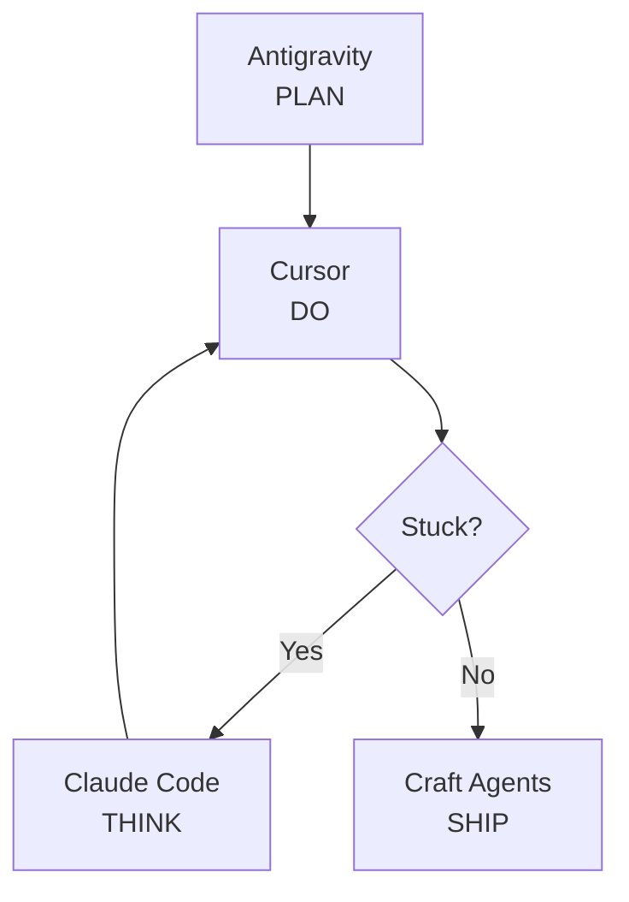

# Phân Tích 20% Giá Trị Cốt Lõi — Quoc Nguyen Van

> **Ngày:** 2026-04-09 | **Nguồn:** Bài viết Tony "AI không thay thế bạn" + ios-memory (SOUL.md, AGENTLYTICS-PROFILE, 9 bài selfreview, DECISIONS.md)
> **Mục đích:** Ánh xạ framework 20% giá trị từ bài viết Tony lên dữ liệu thực tế để xác định chính xác đâu là 20% của Quoc, đâu đang bị lãng phí, và đâu cần khuếch đại.

---

## 1. Framework 20% — Áp Dụng Cho Quoc

Tony chia thế giới thành 2 phần:
- **80%**: Output AI tạo được — "trông gần xong", "đủ tốt + có ngay"
- **20%**: Phần tạo sự khác biệt thật — context, judgment, kinh nghiệm

### Quoc Đang Đứng Ở Đâu?

```
┌──────────────────────────────────────────────────────────────┐
│  QUOC'S 80% (Đã delegate thành công cho AI)                 │
├──────────────────────────────────────────────────────────────┤
│  ✅ Code boilerplate, implement UI từ design                 │
│  ✅ API calls, database schema                               │
│  ✅ Fix syntax, viết test cases cơ bản                       │
│  ✅ Documentation draft                                      │
│  ✅ ASO translation (13 locales tự động)                     │
│  ✅ Commit/push automation (/commit-push 37 lần)             │
├──────────────────────────────────────────────────────────────┤
│  QUOC'S 20% (Giá trị thật)                                  │
├──────────────────────────────────────────────────────────────┤
│  🧠 System Design: Architecture decisions, constraint defs   │
│  🔧 Workflow Orchestration: 4-layer AI tool stack            │
│  👁️ Quality Judgment: "Đủ clean chưa? Scale được không?"     │
│  📐 Factory Model: Build systems, not features               │
└──────────────────────────────────────────────────────────────┘
```

---

## 2. Bằng Chứng Data — 20% Đã Tồn Tại Nhưng Chưa Được Khuếch Đại

### 2.1 Systems Thinking (Superpower #1)

| Evidence | Data |
|----------|------|
| Brainstorm trước implement | 43 sessions brainstorm vs 41 sessions implement |
| Multi-tool orchestration | 4 tools, mỗi tool 1 mục đích (Think-Plan-Do-Ask) |
| Evolution speed | Single-tool → Multi-tool orchestrator trong 2 tháng |
| Factory mindset | ios-kit, ios-memory, ios-pipeline, ios-hub — 4 repos hệ thống |

> [!IMPORTANT]
> **Đây chính là 20% của Quoc theo framework Tony.** Không phải code Swift giỏi (80% AI làm được), mà là khả năng **thiết kế hệ thống để AI làm việc hiệu quả**. Rất ít iOS developer có điều này.

### 2.2 Workflow Rules (Superpower #2)



- 4-layer architecture: Plan → Do → Think → Ship
- Tool Decision Matrix rõ ràng (WORKFLOW-SYSTEM.md)
- Slash commands tự tạo: 50+ workflows custom
- CASS rituals, gate-check, lint automation

### 2.3 Mastery Judgment (Superpower #3)

| Hành vi | Bằng chứng |
|---------|------------|
| "Code phải đủ tầm Resume" | SOUL.md Non-negotiable #1 |
| Options Matrix trước quyết định | SOUL.md: "List options → Chọn approach → Mới code" |
| Revenue vs Showcase negotiation | DECISIONS.md: "Tôi có thể ship MVP clean với scope nhỏ hơn không?" |
| Tech debt management | Refactor đan xen, không skip |

---

## 3. Vấn Đề: 20% Đang Bị "Ảo Giác 80%" Che Mất

Tony viết: *"AI không chỉ làm giảm nhu cầu về chuyên gia. Nó còn làm giảm khả năng nhận ra rằng mình cần chuyên gia."*

### 3.1 Với Bản Thân — Fix-First Bias

| Dấu hiệu | Data |
|-----------|------|
| Fix nhiều hơn Plan | Fix/Debug 65 sessions vs Plan 27 sessions (2.4:1) |
| Plan mode gần như zero | Chỉ 5 sessions dùng plan mode (0.4% tổng) |
| Agent:Plan ratio | 130:1 — execute gấp 130 lần plan |
| Marathon sessions | 31.2% sessions > 100 messages (nhóm lớn nhất) |

> [!WARNING]
> **Quoc đang tự sa vào nghịch lý 80% của Tony:** AI cho output "trông gần xong" → nhảy vào fix → mất thời gian ở phần 80% thay vì focus vào 20% (system design, architecture review). Data cho thấy thời gian planning chỉ chiếm 0.4% tổng sessions.

### 3.2 Với Thị Trường — Chưa Articulate 20%

Tony viết: *"Khả năng articulate tại sao 20% đó quan trọng... đang trở thành kỹ năng ngày càng hiếm."*

| Vấn đề | Thực trạng |
|--------|------------|
| Portfolio chỉ show app | Không ai thấy ios-kit, ios-memory, Spec-to-Ship flow |
| Tooling > Product | 36K LOC tooling > tổng product LOC (80:20 time ratio) |
| Revenue chưa match giá trị | $500/tháng side project, $60/tháng Moboco share |
| Thiếu content showcase | 0 bài viết/case study về workflow system |

### 3.3 Với AI — Quá Delegate, Thiếu Challenge

| Metric | Giá trị | Rủi ro |
|--------|---------|--------|
| AskUser tool | 0.7% (348/48,587) | AI tự quyết, ít bị challenge |
| Cursor amplification | 1:10.8 (1 char input → 10.8 char output) | Trust AI output mà ít verify |
| Commit:Review | 2.5:1 | Push nhiều gấp 2.5 lần review |

---

## 4. Chiến Lược Khuếch Đại 20% — Dựa Trên Data

### Phase 1: Dừng Lãng Phí 20% Vào 80% (Tuần 1-2)

| # | Action | Metric | Target |
|---|--------|--------|--------|
| 1 | **Plan trước Execute** — mỗi feature > 2h phải có plan session | Plan:Agent ratio | 1:130 → 1:20 |
| 2 | **Challenge AI** — mỗi session hỏi "Có cách đơn giản hơn?" 1 lần | AskUser ratio | 0.7% → 3% |
| 3 | **Freeze tooling** — chỉ bugfix, không build feature mới cho ios-kit | Tooling:Product time | 80:20 → 20:80 |

### Phase 2: Showcase 20% Ra Ngoài (Tháng 1-2)

| # | Action | Kết quả kỳ vọng |
|---|--------|-----------------|
| 4 | **Case Study #1:** "Cách tôi dùng 4-layer AI stack ship 14 apps trong 12 tháng" | Thought leadership content |
| 5 | **Open-source ios-kit** (hoặc phần workflow) | Developer community visibility |
| 6 | **Portfolio page** trên mobocovietnam.com show SYSTEM, không chỉ APP | Differentiation từ 99% iOS devs |

### Phase 3: Monetize 20% (Tháng 3-6)

| # | Action | Revenue potential |
|---|--------|-------------------|
| 7 | **Consulting "AI-augmented dev workflow"** cho iOS teams | $50-100/h |
| 8 | **Course/Guide:** "Spec-to-Ship: From Idea to App Store in 7 Days" | Passive income |
| 9 | **ios-kit as SaaS** — template + workflow + agent config package | Recurring |

---

## 5. Tony's Test — Trả Lời 3 Câu Hỏi

### "AI có thể thay thế bạn không?"
**Không.** AI viết Swift giỏi (80%), nhưng không biết:
- Khi nào dùng Coordinator pattern vs NavigationStack
- Tại sao module Y cần refactor trước khi build feature X
- Cách orchestrate 4 AI tools để ship 14 apps solo

### "Người ta còn cần chờ bạn không?"
**Hiện tại: Không rõ.** Vì 20% đang bị ẩn đằng sau code. Người ngoài chỉ thấy app, không thấy system. Cần articulate.

### "20% của bạn có đang bị ảo giác 80% che mất?"
**Có.**
- Fix-first bias khiến Quoc nhảy vào 80% (debug, implement) thay vì ở lại 20% (design, review)
- Tooling 36K LOC impressive nhưng chưa ai biết
- Revenue $500/tháng chưa phản ánh giá trị thật của hệ thống

---

## 6. Kết Luận Một Dòng

> **Quoc đã có 20% — system thinking + workflow orchestration + quality judgment — nhưng đang dành quá nhiều thời gian làm việc 80% (coding/fixing) thay vì khuếch đại và showcase 20% cốt lõi ra thế giới.**

---

## Action Items Ưu Tiên

- [ ] **Ngay:** Thiết lập hard rule "Plan session trước mỗi feature > 2h"
- [ ] **Tuần này:** Freeze tooling, 100% time vào monetization cho 2 apps chưa có IAP
- [ ] **Tháng 4:** Draft Case Study #1 về Spec-to-Ship flow
- [ ] **Tháng 5:** Portfolio page redesign — show System, không chỉ App
